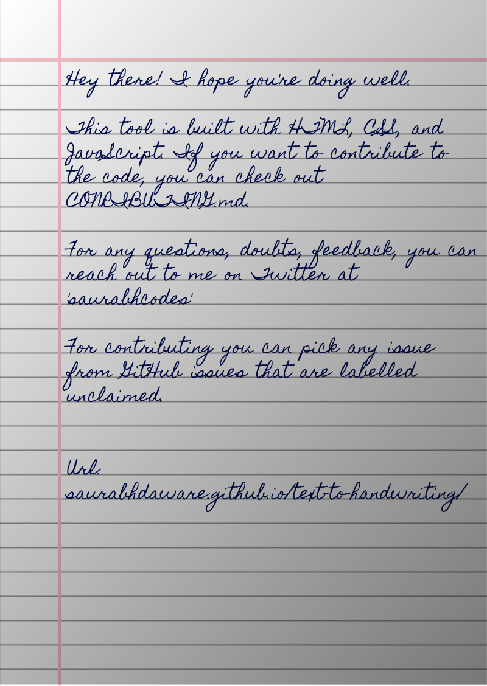

# Instead of putting lots of hour in writing assignments I prefer my fast typing speed therefore created this amazin project

## 🌠 Output

## 🤗 Contributing

Checkout [Contribution Guide](CONTRIBUTING.md) for local setup and contribution guide.

## 📚 Libraries used

- [html2canvas](https://github.com/niklasvh/html2canvas) - Turns DOM into Canvas.
- [jsPDF](https://github.com/MrRio/jsPDF) - To generate PDF from images.
- [cypress](https://github.com/cypress-io/cypress) - Testing Library
- [serve](https://github.com/zeit/serve) - Start local server

---

Bye!
Have fun 🦄 
This project is just for learning original project ➡ <a href="https://github.com/saurabhdaware">@saurabhdaware</a>
